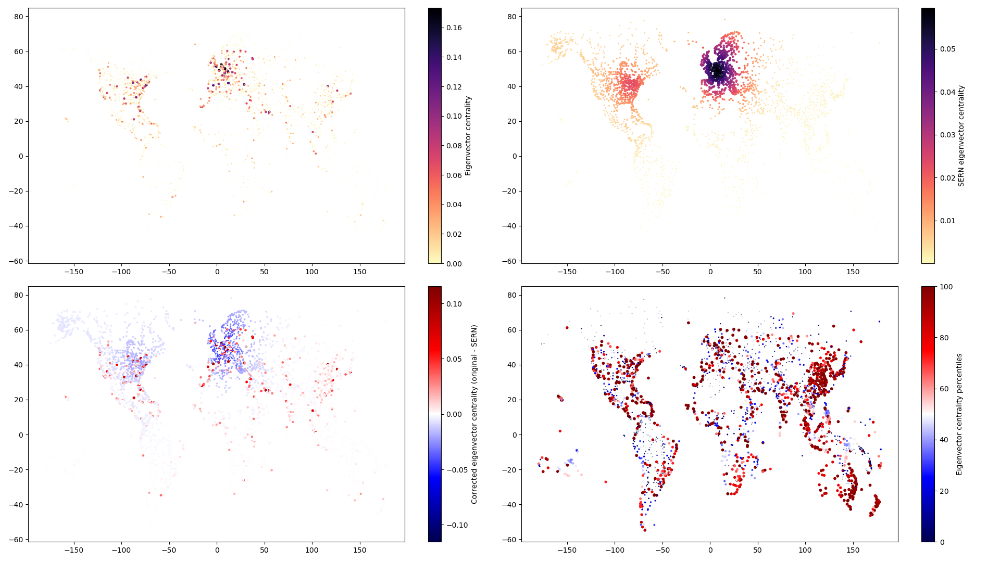

# spatial-effects-networks
## Spatial effects in network measures of spatially embedded networks 

This provides a set of Python functions that implement concepts as proposed in the corresponding study about spatial effects in network analyses (see [DOI: 10.1209/0295-5075/100/28002](http://dx.doi.org/10.1209/0295-5075/100/28002 "Rheinwalt et al., Boundary effects in network measures of spatially embedded networks (2012)")). The fundamental idea is to quantify the influence of the spatial embedding on network measures. This is done by constructing an ensemble of spatially embedded random networks (SERN) that share the same spatial embedding and link probability depending on link length as the original network of interest. A network measure on such a set of surrogate networks quantifies how that given network measure is affected by the spatial embedding.

The provided set of Python functions are explained in the following example of the global flight network. Considered are all flights from [openflights.org](https://openflights.org/data.html) as an undirected network and the focus is on the network measure [eigenvector centrality](https://en.wikipedia.org/wiki/Eigenvector_centrality) as implemented by [graph tool](https://en.wikipedia.org/wiki/Eigenvector_centrality) and how it is influenced by the location of airports (spatial embedding).

For this we import all functions from [sern.py](./sern.py) as well as graph tool and a few other standard Python modules.

    import sern as sn
    import numpy as np
    from matplotlib import pyplot as pl
    from scipy.stats import percentileofscore
    import graph_tool.all as gt

Now we can load all airports from the file *nodes* and all flight routes from the file *links*.

    ids, lon, lat = np.loadtxt('nodes', unpack = True)
    links = np.loadtxt('links', dtype = 'int')

Then we construct the adjacency matrix and edge list by:

    A, b = sn.AdjacencyMatrix(ids, links)
    lon, lat = lon[b], lat[b]
    n = A.shape[0]
    A[np.tril_indices(n)] = 0
    edges = np.transpose(A.nonzero())
    A = A[np.triu_indices(n, 1)]

Using graph tool we construct a graph object and measure the eigenvector centrality of the original network:

    g = sn.Graph(edges, n)
    _, v = gt.eigenvector(g)
    vo = np.array(v.a)

In order to derive the link probability depending on the spatial length of links we need to compute all spatial distances between airports and round them to appropriately scaled integers. This allows us to use distances as indices for arrays.

    D, x = sn.IntegerDistances(lat, lon)

With these integer distances we can derive the link probability:

    p = sn.LinkProbability(A, D)

Finally, we construct an ensemble of 1000 surrogate networks and measure the eigenvector centrality on each of them.

    M = 1000
    var = np.zeros((M, n))
    for i in range(M):
        e = sn.SernEdges(D, p, n)
        g = sn.Graph(e, n)
        _, v = gt.eigenvector(g)
        v = np.array(v.a)
        var[i,:] = v

In *vo* we have the original measure for each airport and in *var* we have a distribution of the measure for each airport. In [sern_example.py](./sern_example.py "Eigenvector centrality example for the global flight network") the eigenvector centrality of the original network (A) is shown together with the expected eigenvector centrality due to the spatial embedding (B), as well as the difference between the two (C), and the percentiles of the measure on the original network in the distribution of measures in *var* (D). I.e., A shows *vo*, B shows *var.mean(axis = 0)*, C shows *vo - var.mean(axis = 0)*, and D shows *\[percentileofscore(var[:,i], vo[i]) for i in range(n)\]*.

One interpretation of these results could be, that due to the high density of airports in Europe and the US (east coast) the expected eigenvector centrality is high given the observed link probability depending on distance (see B). However, not all airports actually have such a high centrality (see blue airports in C), but a few hubs have even higher centralities (see red airports in C). In terms of percentiles the ensemble of SERN can also be seen as a NULL model. In that sense many airports in coastal regions have a higher eigenvector centrality than expected (see red airports in D).

